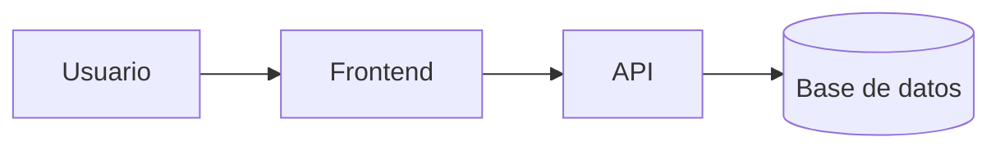

# Sistema de Gestión de Biblioteca Virtual
 

Una plataforma web integral para la gestión de préstamos, catálogo de libros y reportes en tiempo real para instituciones educativas.

## Tabla de contenidos
- [Descripción](#descripción)
- [Instalación](#instalación)
- [Uso](#uso)
- [Estado de funcionalidades](#estado-de-funcionalidades)
- [Pendientes](#pendientes)
- [Arquitectura](#arquitectura)
- [Contribuidores](#contribuidores)

## Descripción
Este proyecto busca automatizar el registro y préstamo de libros de forma digital. Permite a los usuarios consultar el catálogo disponible, gestionar reservas y generar reportes administrativos en tiempo real.

## Instalación
bash
git clone https://github.com/yordirodriguez-bot/laboratorio-readme.git
cd laboratorio-readme
npm install

## Uso
bash
npm start

## Estado de funcionalidades

| Función | Estado |
|---|---|
| Autenticación de usuarios | Listo |
| Búsqueda de libros | Listo |
| Módulo de reservas | En progreso |
| Reportes PDF | Pendiente |

## tareas Pendientes

- [x] Diseño de la base de datos
- [x] Maquetado de la interfaz principal
- [ ] Integración con pasarela de pagos
- [ ] Pruebas unitarias de la API

## Arquitectura

## Contribuidores

- **Yordi Rodríguez** - [@yordirodriguez-bot](https://github.com/yordirodriguez-bot)
